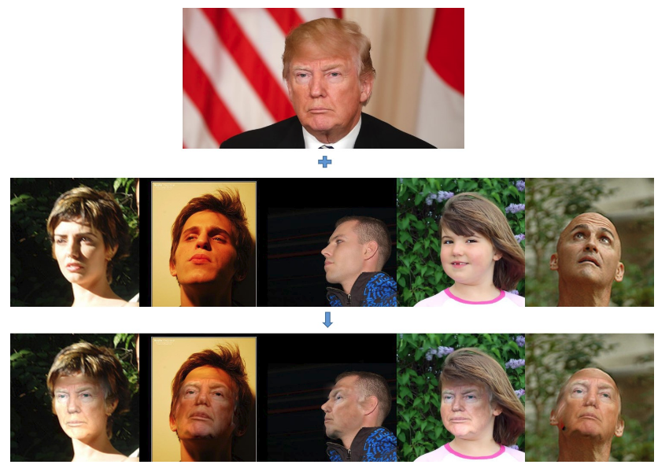
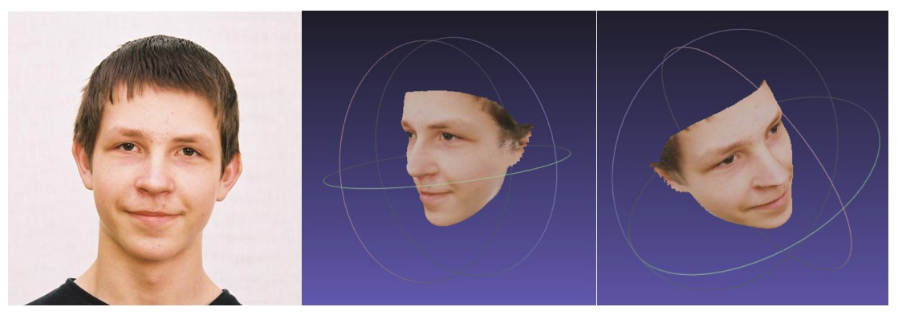
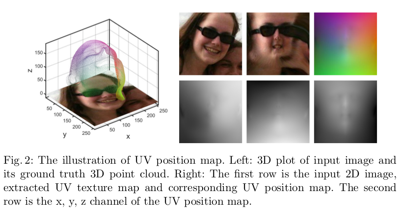
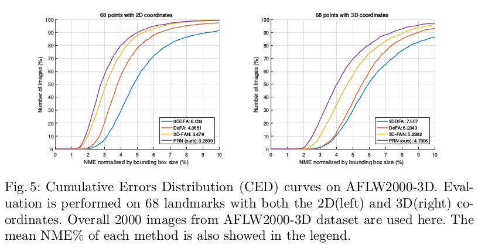
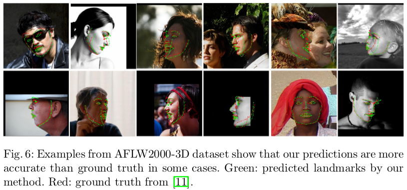

# PRNet 论文阅读总结和讨论

look for [papers for PRNet](https://arxiv.org/pdf/1803.07835.pdf)


# Overview

+ 端到端的人脸3D重建模型，同时直接预测人脸的【实际上就是UV空间预测并直接解码，UV空间后面叙述】
> 以前的模型或者需要首先回归3DMM参数来计算3D空间，或者需要回归特征3D点随后进行非线性优化获取3DMM参数，随后使用3DMM参数来得到稠密的人脸模型,这些方法都是基于3DMM模型的。
> 当然也有2D的方法，先回归得到2D的不少坐标点，并预测深度图，根据深度度和2D点重建稠密3D人脸
+ 这个模型做到了在1080的显卡上仅仅需要 9ms的速率，相对于之前的各种方法有了很明显的提升，同时在评判指标CED，NME上也有显著的提升
> NME : normalised mean error : 归一化的，参考长度的坐标偏差衡量指标，用来评判人脸关键点回归质量的重要指数

> CED : NME和数据集比例曲线，衡量在NME达到一定错误率时，已经覆盖的数据集比例，模型的鲁棒性指标

# 效果概览

+ 人脸关键点和3D重建结构效果


+ PRNet 根据人脸关键3D位置及其相应纹理，进行的换脸术。


+ PRNet重建的稠密3D人脸

# UV 空间

+ 左图是二维人脸图片以及对应的稠密3D点云。
+ 右图是UV空间表示。
> 第一排第一张是原始图片，第一排第二张是将人脸RGB通道映射到UV空间的对应位置【UV空间纹理图】，第一排第三张是UV空间位置图，每个通道表示对应纹理的xyz。

> 第二排是 UV空间的位置图三个通道的展开。
> GT 就是ＵＶ位置空间，在代码中维度是（256,256,3）

# 网络结构

```
def resBlock(x, num_outputs, kernel_size = 4, stride=1, activation_fn=tf.nn.relu, normalizer_fn=tcl.batch_norm, scope=None):
    assert num_outputs%2==0 #num_outputs must be divided by channel_factor(2 here)
    with tf.variable_scope(scope, 'resBlock'):
        shortcut = x
        if stride != 1 or x.get_shape()[3] != num_outputs:
            shortcut = tcl.conv2d(shortcut, num_outputs, kernel_size=1, stride=stride, 
                        activation_fn=None, normalizer_fn=None, scope='shortcut')
        x = tcl.conv2d(x, num_outputs/2, kernel_size=1, stride=1, padding='SAME')
        x = tcl.conv2d(x, num_outputs/2, kernel_size=kernel_size, stride=stride, padding='SAME')
        x = tcl.conv2d(x, num_outputs, kernel_size=1, stride=1, activation_fn=None, padding='SAME', normalizer_fn=None)

        x += shortcut       
        x = normalizer_fn(x)
        x = activation_fn(x)
    return x
```
> 残差结构实现，如上激活是relu，归一化是BN，shortcut对应三次卷积，随后通道合并，最后归一化和激活。

```
    size = 16  
    # x: s x s x 3
    se = tcl.conv2d(x, num_outputs=size, kernel_size=4, stride=1) # 256 x 256 x 16
    se = resBlock(se, num_outputs=size * 2, kernel_size=4, stride=2) # 128 x 128 x 32
    se = resBlock(se, num_outputs=size * 2, kernel_size=4, stride=1) # 128 x 128 x 32
    se = resBlock(se, num_outputs=size * 4, kernel_size=4, stride=2) # 64 x 64 x 64
    se = resBlock(se, num_outputs=size * 4, kernel_size=4, stride=1) # 64 x 64 x 64
    se = resBlock(se, num_outputs=size * 8, kernel_size=4, stride=2) # 32 x 32 x 128
    se = resBlock(se, num_outputs=size * 8, kernel_size=4, stride=1) # 32 x 32 x 128
    se = resBlock(se, num_outputs=size * 16, kernel_size=4, stride=2) # 16 x 16 x 256
    se = resBlock(se, num_outputs=size * 16, kernel_size=4, stride=1) # 16 x 16 x 256
    se = resBlock(se, num_outputs=size * 32, kernel_size=4, stride=2) # 8 x 8 x 512
    se = resBlock(se, num_outputs=size * 32, kernel_size=4, stride=1) # 8 x 8 x 512
    
    pd = tcl.conv2d_transpose(se, size * 32, 4, stride=1) # 8 x 8 x 512 
    pd = tcl.conv2d_transpose(pd, size * 16, 4, stride=2) # 16 x 16 x 256 
    pd = tcl.conv2d_transpose(pd, size * 16, 4, stride=1) # 16 x 16 x 256 
    pd = tcl.conv2d_transpose(pd, size * 16, 4, stride=1) # 16 x 16 x 256 
    pd = tcl.conv2d_transpose(pd, size * 8, 4, stride=2) # 32 x 32 x 128 
    pd = tcl.conv2d_transpose(pd, size * 8, 4, stride=1) # 32 x 32 x 128 
    pd = tcl.conv2d_transpose(pd, size * 8, 4, stride=1) # 32 x 32 x 128 
    pd = tcl.conv2d_transpose(pd, size * 4, 4, stride=2) # 64 x 64 x 64 
    pd = tcl.conv2d_transpose(pd, size * 4, 4, stride=1) # 64 x 64 x 64 
    pd = tcl.conv2d_transpose(pd, size * 4, 4, stride=1) # 64 x 64 x 64 
    
    pd = tcl.conv2d_transpose(pd, size * 2, 4, stride=2) # 128 x 128 x 32
    pd = tcl.conv2d_transpose(pd, size * 2, 4, stride=1) # 128 x 128 x 32
    pd = tcl.conv2d_transpose(pd, size, 4, stride=2) # 256 x 256 x 16
    pd = tcl.conv2d_transpose(pd, size, 4, stride=1) # 256 x 256 x 16
    
    pd = tcl.conv2d_transpose(pd, 3, 4, stride=1) # 256 x 256 x 3
    pd = tcl.conv2d_transpose(pd, 3, 4, stride=1) # 256 x 256 x 3
    pos = tcl.conv2d_transpose(pd, 3, 4, stride=1, activation_fn = tf.nn.sigmoid)
```

> 网络结构如上图所示，有两部分组成，网络残差和反卷积。最后激活使用sigmoid得到输出UV空间。


# Loss设计


+ P(x,y) 是UV位置空间的预测结果,表征了UV图上对应像素的xyz位置
+ W(x,y) 是UV位置空间的权重,对UV空间进行权重控制,关键点:眼鼻嘴:脸部其他:其他 = 16:4:3:0


# 训练细节

+ 训练数据来源: 使用了300W-LP数据集,
    + 拥有各个角度的人脸数据,使用时scale到256x256
    + 3DMM系数的标注
    + 使用3DMM 生成3D点云,并转换3D点云至UV空间
> 注: 虽然生成GT使用了3DMM的标注系数,但是模型本身不包含3DMM模型的任何线性约束.
+ 数据增广包含了所有的困难场景:
    + 角度变换 -45 ~ 45 度
    + 平移系数 0.9 ~ 1.2 (原图大小为基数)
    + 颜色通道变换 0.6 ~ 1.4
    + 添加噪音纹理遮挡,模拟真实情况遮挡.
+ adam优化器,初始学习率0.0001,每5个epoch,衰减1半,batch size:16


# 测试结果


+ 上面两图记录了68个关键点和所有点的CED曲线走向情况,总的来说都有不少提升.


+ 角度变化情况下的,3D人脸关键点的NME效果对比


+ 上图使用了瞳间距作为归一化分母,这样更加形象的表达了算法效果.


+ 推理时间[1080显卡]


+ 与各种方法比如VRN在不同角度下,和3d稠密重建效果的对比.


+ 部分推理结果超过GT,训练过程忽略掉的GT噪声


